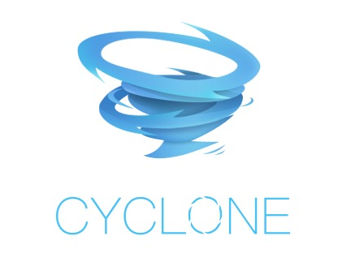

# Cyclone

<p align="center"></p>

[](https://travis-ci.org/caicloud/cyclone)
[](https://goreportcard.com/report/github.com/caicloud/cyclone)
[](https://bestpractices.coreinfrastructure.org/projects/2792)
[](https://coveralls.io/github/caicloud/cyclone?branch=master)
[](https://godoc.org/github.com/caicloud/cyclone)
[](./LICENSE)

Cyclone is a powerful workflow engine and end-to-end pipeline solution implemented with native Kubernetes resources,
with no extra dependencies. It can run anywhere Kubernetes is deployed: public cloud, on-prem or hybrid cloud.

Cyclone is architectured with a low-level workflow engine that is application agnostic, offering capabilities like
workflow DAG scheduling, resource lifecycle management and most importantly, a pluggable and extensible framework for
extending the core APIs. Above which, Cyclone provides built-in support for high-level functionalities, with CI/CD
pipelines and AI DevOps being two notable examples, and it is possible to expand to more use cases as well.

With Cyclone, users end up with the flexibility of workflow orchestration and the usability of complete CI/CD and AI DevOps solutions.

## Features

- DAG graph scheduling: Cyclone supports DAG workflow execution
- Parameterization: stage (unit of execution) can be parameterized to maximize configuration reuse
- External integration: external systems like SCM, docker registry, S3 can be easily integrated with Cyclone
- Triggers: Cyclone supports cron and webhook trigger today, with upcoming support for other types of triggers
- Controllability: workflow execution can be paused, resumed, retried or cancelled
- Multi-cluster: workflow can be executed in different clusters from where Cyclone is running
- Multi-tenancy: resource manifests and workflow executions are grouped and isolated per tenant
- Garbage Collection: automatic resource cleanup after workflow execution
- Logging: logs are persisted and independent from workflow lifecycle, enabling offline inspection
- Built-in Pipeline: curated DAG templates and stage runtimes for running DevOps pipelines for both regular software and AI development
- Delegation Workload: Delegate some complicated stage to be executed in external systems, instead of Cyclone.

## Quick Start

> Cyclone has been tested with Kubernetes 1.12, 1.13 and 1.14.

Make sure [Helm](https://helm.sh/) with a version higher than **2.10** is installed ([install guide](https://helm.sh/docs/using_helm/#install-helm)), then install Cyclone with:

```bash
$ helm install --name cyclone --namespace cyclone-system ./helm/cyclone
```

If you want to configure the installation or want to install from source code, please refer to [Cyclone Install Guide](docs/installation.md).

Then you can access Cyclone with kubectl or Cyclone web (http://<node-ip>:30022).

## Community

- **Slack**: Join [Cyclone Community](https://cycloneworkflow.slack.com/) for disscussions and posting questions. If you are not yet a member of Cyclone Slack, you may sign up [here](https://join.slack.com/t/cycloneworkflow/shared_invite/enQtNzc3NzY1MjY1MTY4LTNmZTQ2ZjQxOTM1ZDE0ZDJlMDhiOTk2YTU4MzdmYmVhNDE0NDYxMTk1ODYyNmRmNzkzNWRiYTMzYmI0ZWIxMWU).

## Aditional Tools

- [cycli](https://github.com/cd1989/cycli) Cyclone CLI interface

## Roadmap

[Cyclone Roadmap](./docs/ROADMAP.md)

## Contributing

If you are interested in contributing to Cyclone, please checkout [CONTRIBUTING.md](./CONTRIBUTING.md).
We welcome any code or non-code contribution!

## Licensing

Cyclone is licensed under the Apache License, Version 2.0. See [LICENSE](./LICENSE) for the full license text.
