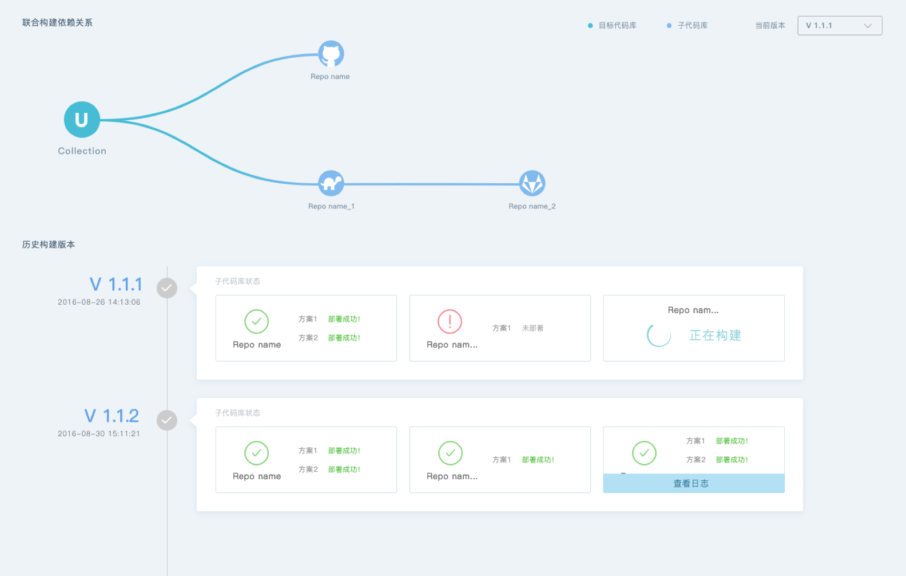
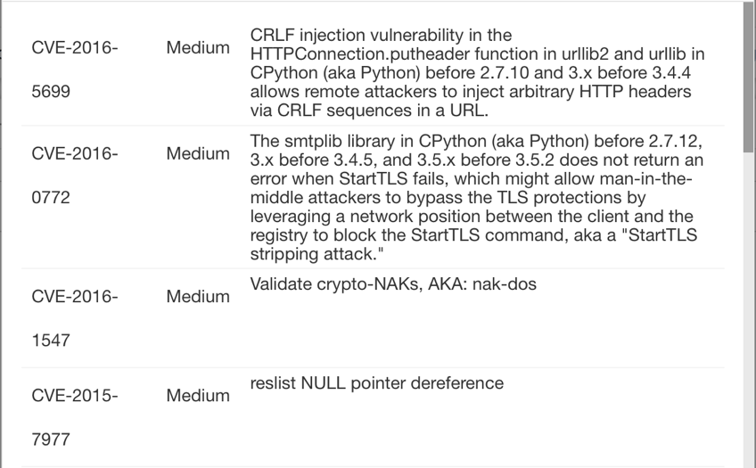

中文 | [English](README.md)

<h1 align="center">
	 
	
	 
	 
</h1>

单元测试

端到端测试

Cyclone 是一个打造容器工作流的云原生持续集成持续发布平台。

Cyclone 主要致力于将代码从本地开发环境用任意容器引擎封装搬运到测试或者生产环境运行。Cyclone 包括以下特性：

- **容器原生**: 每次构建、集成、部署均在容器中运行，完全解决运行时环境不一致的问题。
- **依赖关系**: 定义依赖规则或简单的组件关系，确保执行顺序依照既定策略。
- **版本控制**: 基于版本控制构建，检索镜像/流水线历史就像查询版本管理接口一样简单。
- **双向绑定**: 记录每次 CI/CD 操作用于回答类似问题：“各容器镜像部署在集群哪个角落？”
- **安全第一**: 安全是基本要素，有效阻拦不安全镜像进入生产环境。

## 相关文档

### 安装手册

你可以查看[安装手册](./docs/setup_zh-CN.md)来搭建一个 Cyclone 实例。

### 快速开始

[快速开始](./docs/quick-start_zh-CN.md)体验 Cyclone 的构建过程。

### Caicloud.yml 配置文件介绍

当给定 `caicloud.yml` 作为配置文件后，Cyclone 会根据配置文件来执行创建版本的过程。你可以在 [caicloud.yml 配置文件介绍](./docs/caicloud-yml-introduction_zh-CN.md)中看到对配置文件的具体介绍。

### 开发者指南

欢迎为 Cyclone 提供更多特性，让它变得更好用，我们有一份[开发者指南](./docs/developer-guide_zh-CN.md)可以帮助你了解如何向 Cyclone 项目贡献代码或者文档。

## 特性预览

### 依赖管理

	

### 安全扫描

	

## Roadmap

| 里程碑     | 新特性                      |
| ------- | ------------------------ |
| 2016年Q4 | k8s 支持：使用 k8s-job 执行 CI/CD 工作流 |
| 2017年Q1 | web 操作界面                  |
| 今后      | 用户管理权限  支持用户插件            |
