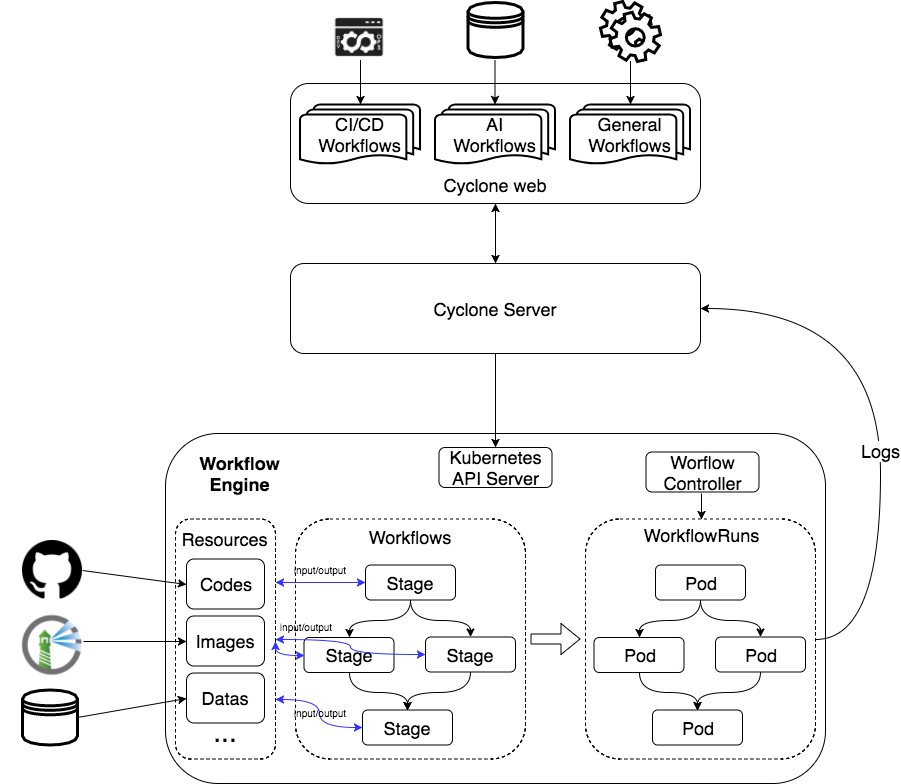

# Cyclone Design

Cyclone is a powerful workflow engine with end-to-end pipeline solutions (such as CI/CD and AI DevOps) implemented with native Kubernetes resources. 
Cyclone is architectured with a low-level workflow engine that is application agnostic, offering capabilities like
workflow Directed Acyclic Graph (DAG) scheduling, resource lifecycle management, etc.

## Architecture

### Components

* Cyclone Web: helps users to easily use Cyclone.
* Cyclone Server: provides a set of RESTful APIs to operate Cyclone resources.
* Workflow Controller: controls the execution of stages in workflows.

### Kubernetes CRDs

* Stage: the minimum executable unit for a workflow, which performs certain work on input resources and outputs results.
* Resource: the data or artifacts used by stages as input or output, such as git repository or docker images.
* Workflow: executable DAG graph composed of stages.
* WorkflowRun: running record of a workflow.
* WorkflowTrigger: auto-trigger policy for workflows.

More Details: [Kubernetes Resources Used by Cyclone](./develop/crd.md)

## Implementation

### Workflow Engine

Workflow controller is the main component of the workflow engine. It watches various kinds of Cyclone CRDs, and controls the execution of workflows.

Workflow controller creates a pod for each stage to execute, and there are 3 kinds of containers in the pod:

* Init Containers: Init containers will prepare input resources for the stage before workload containers start.
* Workload Containers: Workload containers are functional containers, which do the main work for stages.
* Sidecar Containers: There are 2 common sidecar containers.
  * Coordinator: Coordinator sidecar is in charge of log collection, artifact collection and notifying resource resolver to handle output resources.
    Workflow controller regards a stage pod completed when the coordinator sidecar container completed.
  * Resource Resolver: Resource resolver sidecar will handle the output resources after workload containers finished.

### Resources

Each type of resource needs a resource resolver to handle their resources. Now Cyclone supports 4 types of resources:

* Image: Image resources in the registry, supports pulling and pushing operations.
* Git: Code resources in Git SCM like Github and Gitlab, only supports pulling source code.
* SVN: Code resources in SVN, only supports pulling source code.
* General: General type allows users to implement handlers by themselves for other types of resources.

### Workflow Executation

Workflow is an executable DAG graph composed of stages which can run
either serially or in parallel according to the graph structure.  If
one stage has dependencies, it can only start to run after all its
dependencies have finished. Stages can run in parallel if they have no
direct or indirect mutual dependency.
