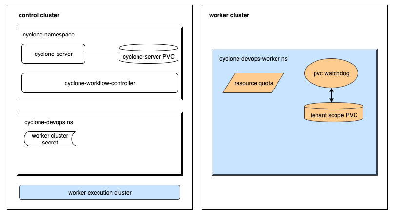

# Kubernetes Resources Used by Cyclone

As we known Cyclone is implemented with native Kubernetes resources with no extra dependencies. Following we will illustrate all resources used by Cyclone, including Kubernetes originally defined and Cyclone defined.

## Kubernetes Original Resources

* **Namespace**: Cyclone is a multi-tenant isolated system.

    In general, there are two namespaces for each tenant:

    * Metadata namespace: Stores metadata for one tenant, and holds its basic information in annotations. *MUST* be in the control cluster where Cyclone runs, named in format of `cyclone-{tenant-name}`

    * Workload namespace: Where workloads execute. Can be in control cluster OR worker clusters.

    However you can explicitly specify the two namespaces as one: `cyclone-{tenant-name}`, then Cyclone will store metadata and execute Workload in it. But we do **NOT** recommend it for single responsibility reason, we can easily recover when workload namespace gets ruined if it is not responsible for storing metadata.

* **Secret**: Cyclone supports [integrating external systems](./user_guide.md#integration-center). Cyclone uses `Secret` to protect the auth information of external systems as it is pretty sensitive.

* **PVC**: Cyclone uses `PVC` to share data between pods.

    There are two types of `PVC` Cyclone used:

    * Tenant Scope PVC: Each tenant has a `PVC` in the Workload namespace to 
        * Share runtime data among different Pods belongs to the same WorkflowRun.
        * (Optional) Cache data to accelerate Workflow's next time executing. 

    * Cyclone-server PVC: Usually we configure a `PVC` for Cyclone-server to store and serve
        * Logs generated by Workflow running
        * Artifacts generated by Workflow running

        If your Cyclone-server has only one replica, the Cyclone-server PVC is recommended instead of required, you can use the disk of pod if you think the logs and artifacts are not important. But if the replica of your Cyclone-server is greater than one, the Cyclone-server PVC is required as multiple Cyclone-server instances need to share the data.

* **ResourceQuota**: Each tenant has a `ResourceQuota` in the Workload namespace to limit CPU/Memory usage.

* **Pod**: As we all known Pod are the smallest schedulable units in Kubernetes and Cyclone is a Kubernetes native workflow engine, Cyclone creates and manages Pod to run tasks.

    There are three types of pods used by Cyclone, and they all running in their own Workload namespace for each tenant:
    * Workload pod(OR called Stage Pod): One pod per stage. A workload pod executes tasks defined in a stage.
    * GC pod: One pod per WorkflowRun. As mentioned above that tenant scope PVC shares runtime data, which is temporary data and needs to be cleaned after WorkflowRun completes. The GC pod does the cleaning work.
    * PVC watchdog: One pod per tenant. It is a long running pod in each Workload namespace. It watches the usages of tenant scope PVC and reports the usage information to Cyclone-server periodically.

## Custom Resources (Cyclone Defined)

* **ExecutionCluster**: cluster scope, ExecutionCluster keeps cluster auth information. When Cyclone-workflow-engine watches the creation of ExecutionCluster, it will use the cluster auth information to start a Pod Controller to watch Pods in the cluster specified by the ExecutionCluster.

* **Project**: tenant scope, We mostly regard the project as a logical concept, it manages a group of workflows and their shared configs(like default quota used by Stage Pod).

* **Resource**: tenant scope, the data used by stages as inputs or outputs, such as git repository's codes or docker images. Each type of resource needs a `Resolver` to pull(input) and push(output) resources.

* **Stage**: tenant scope, the minimum executable unit for a Workflow. Stage defines the workloads into two types:
    * Pod workload: Use Kubernetes pod spec(required) and Cyclone input/output Resource(if needed) to perform workload.
    * Delegation workload: Delegate the task to an external system by a URL, and the external system *MUST* report the result of the workload otherwise Cyclone will wait until timeout.

* **Workflow**: tenant scope, executable DAG graph composed of stages.

* **WorkflowTrigger**: tenant scope, auto-trigger policy for workflows. Cyclone supports two types of auto-trigger:
    * Cron
    * SCM webhook

* **WorkflowRun**: tenant scope, running record of a Workflow. Once there is a WorkflowRun created, Cyclone-workflow-engine will start to run the Workflow and record the running status into a WorkflowRun.

---

## Running a Workflow Step by Step

Suppose you separate the running of Workflow and Cyclone components into different clusters, then there will be a control cluster where Cyclone is installed, and a worker cluster to run Workflow.

How does Cyclone run a Workflow step by step? What resources will be created in these clusters?

1. Create a tenant named `devops`, Cyclone will create a namespace `cyclone-devops` in the control cluster to store metadata of the tenant.

2. Create cluster type integration to config worker cluster's auth information. Cyclone will store it in `cyclone-devops` namespace by secret.

3. Configure a namespace(e.g. `cyclone-devops-worker`) in the worker cluster to execute Workflows. In the worker cluster's workload namespace, Cyclone will create a ResourceQuota, a tenant scope PVC, and a long running watchdog Pod. 
In the control cluster, Cyclone will create an ExecutionCluster for the worker cluster if it does not exist.

4. After all of the above has been done, we can construct our Workflow by creating Resources, Stages, and Workflows.

5. After creating a Workflow, we can create a WorkflowRun to request Cyclone to execute the Workflow.

6. When the WorkflowRun execute completed, Cyclone will launch a GC Pod to cleanup the data generated by this WorkflowRun in the PVC.

