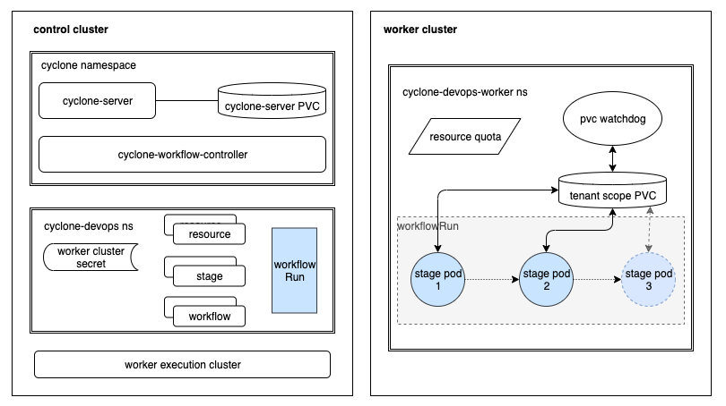
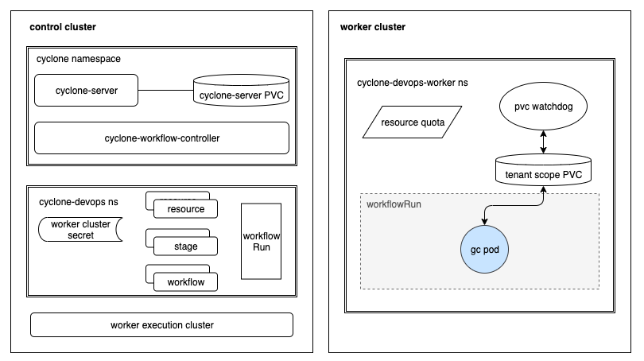

# Kubernetes Resources Used by Cyclone

As we known Cyclone is implemented with native Kubernetes resources with no extra dependencies. Following we will explain resources Kubernetes originally Defined and Cyclone Defined.

## Kubernetes Original Resources

* **Namespace**: Cyclone is a Multi-Tenant Isolation system. 

    In general, there are two namespaces for each tenant:

    * Metadata namespace: Store Metadata for one Tenant, and hold the tenant description information in annotations. *MUST* in the Control cluster(cluster cyclone running in), named in format of `cyclone-{tenant-name}`

    * Workload namespace: Execute Workload. Maybe in the Control cluster OR other clusters. 

    However you can explicitly specify the two namespaces as one: `cyclone-{tenant-name}`, then Cyclone will store metadata and execute Workload in it(Not Recommend).

* **Secret**: Cyclone supports [integrate external systems](./user_guide.md#integration-center).Cyclone uses `Secret` to protect the auth information of external systems as it is pretty sensitive.

* **PVC**: Cyclone uses `PVC` to share data in different pods.

    There are two types of' PVC' Cyclone used:

    * Tenant Scope PVC: Each tenant has a `PVC` in the Workload namespace to 
        * Share runtime data among different Pods belongs to the same WorkflowRun.
        * (Optional) Cache data to accelerate Workflow's next time executing. 

    * Cyclone-Server PVC: Usually we configure a `PVC` for Cyclone-Server to store and serve
        * Logs generated by Workflow Running
        * Artifacts generated by Workflow Running

* **ResourceQuota**: Each tenant has a `ResourceQuota` in the Workload namespace to control CPU/Memory resources.

* **Pod**: As we all known Pod are the smallest deployable units in Kubernetes and Cyclone is a Kubernetes native Workflow Engine, Cyclone creates and manages Pod to run tasks. 

    There are three types of' Pod' Cyclone used, and they all running in their own Workload namespace for each Tenant:
    * Workload pod(OR called Stage Pod): One stage a pod. A workload pod executes tasks defined in a stage.
    * GC pod: One WorkflowRun a pod. As mentioned above that Tenant Scope PVC shares runtime data, and the runtime data needs to be cleaned after running completed. The GC pod does this job.
    * PVC watchdog: One tenant a pod.  **Long-Running** in the Workload namespace. It watches the usages of Tenant Scope PVC and reports the usages information to Cyclone-Server periodically. 

## Custom Resources (Cyclone Defined)

* **ExecutionCluster**: Cluster Scope, ExecutionCluster keeps Cluster Auth information. Cyclone-Workflow-Engine watches ExecutionCluster, once there is an ExecutionCluster created, Cyclone-Workflow-Engine will use the cluster auth information to start a Pod Controller to watch Pods in the cluster which the corresponding ExecutionCluster specified.

* **Project**: Tenant Scope, We mostly regard the project as a logical concept, it manages a group of workflows and their shared configs(like default quota used by Stage Pod)

* **Resource**: Tenant Scope, the data used by stages as input or output, such as git repository's codes or docker images, Each type resource needs a `Resolver` to implement pull(input) and push(output) resource.

* **Stage**: Tenant Scope, the minimum executable unit for a workflow, Stage defines the certain workload specification in two types:
    * Pod workload: Use Kubernetes pod spec(required) and Cyclone input/output Resource(If needed) to order Cyclone starting a Stage Pod to perform workload.
    * Delegation workload: Delegate the task to an external system by a URL, the external system *MUST* notify the result of the workload otherwise Cyclone will Wait until timeout.

* **Workflow**: Tenant Scope, executable DAG graph composed of stages.

* **WorkflowTrigger**: Tenant Scope, auto-trigger policy for workflows. Cyclone supports two types of auto-trigger:
    * Cron
    * SCM webhook

* **WorkflowRun**: Tenant Scope, running record of a workflow. Once there is a WorkflowRun created, Cyclone-Workflow-Engine will start to run the workflow and record the running status into WorkflowRun.

---

## Running a Workflow step by step

How does cyclone run a Workflow step by step? Suppose you have two clusters, one installed cyclone (called control cluster), the other one is used to running Workflow as planned(called worker cluster). What resources do you have in your clusters? 

1. Create a tenant named `devops`, Cyclone will create a namespace `cyclone-devops` in the control cluster to store metadata of the tenant.

2. Create Cluster type integration to save worker cluster's auth information; Cyclone will store it in `cyclone-devops` namespace by secret.

3. Configure a namespace(e.g. `cyclone-devops-worker`) in the worker cluster to execute Workflows; In the worker cluster's workload namespace, Cyclone will create a ResourceQuta, the Tenant Scope PVC, and the Long-Running watchdog pod. In the control cluster, Cyclone will create an ExecutionCluster for the worker cluster if it does not exist.

4. All of the above has been done, now we can construct our Workflow by creating Resources, Stages, and Workflows.

5. After creating a Workflow, we can create a WorkflowRun to request Cyclone to execute the Workflow.

6. When the WorkflowRun execute completed, Cyclone will launch a GC Pod to cleanup data generated by this WorkflowRun in the PVC.

