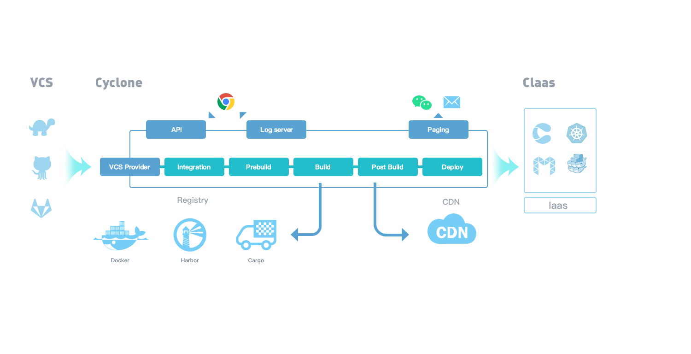

# Developer Guide

This section of the documentation contains a guide for users who want to contribute code or documentation to Cyclone.

## The process of developing the Cyclone project

Now the Cyclone project is hosted on Github, so we follow the [github flow](https://guides.github.com/introduction/flow/), you could learn it within 5 minutes:)

## Setting up your dev environment

We have written some bash scripts to help you start contributing code or documentation to the Cyclone project.

If you want to start a cyclone server for dev, you could run:

```shell
./scripts/local-up.sh
```

The script would run all the dependencies in docker containers, compile and run cyclone server **locally**. This way is more hackable than running all services in containers.

Notice that if your docker daemon is running in a docker machine, maybe you need to do some additional work, such as port forwarding and so on.

## Test your contribution

We have unit test and e2e test cases, you could run these test cases to test your contribution.

### Unit Testing

You could run unit test by typing:

```shell
./tests/run-unit-test.sh
```

And Our travis CI jobs would also run these, so you could also check out the build log to get the test result in travis. In the future we would run these tests by cyclone.

### End-to-end Testing

Now cyclone's e2e test would start a local circle server and register local docker host as a worker to circle server. Then it would start a standalone process to run the e2e test cases by sending RESTful requests.

You could run e2e test by typing:

```shell
./tests/run-e2e.sh
```

In the future we would run these tests by cyclone.

## API Documentation

We use [swagger ui](https://github.com/swagger-api/swagger-ui) to generate API documentation. If your work impacts cyclone API, you could check out API documentation at `http://<your cyclone server host>:7099/apidocs`, else you could check out [our online API documentation](http://118.193.142.27:7099/apidocs/).

## Architecture and workflow of the Cyclone project

### Workflow



- Cyclone provides abundant [APIs](http://118.193.142.27:7099/apidocs/) for web applications.
- After registering the code repository in VCS with Cyclone via API, commiting and releasing to VCS will notify Cyclone-Server by webhook.
- Cyclone-Server will run a Cyclone-Worker container which uses the “Docker in Docker” technique. The Cyclone-Worker container will checkout code from VCS, then execute steps according to the configrations of caicloud.yml in the code repository as follows:
 - PreBuild: compile the source code from VCS and generate the executable file in the specified system environment
 - Build: copy the executable file to the specified system environment, package the environment to a docker image and push the image to the specified docker registry
 - Integration: run a container and bring up its dependencies (as other containers specified in the configuration) to perform integration testing. If the image of service configurated as "BUILT_IMAGE", it will use the newly built image.**
 - PostBuild: run a container to execute some shells or commads which aim to do some related operations after the images is published in the registry
 - Deploy: deploy the containerized application into a containerized platform like Kubernetes.
- The logs durning the entire workflow can be pulled from Cyclone-Server via websocket
- Cyclone-Server will send the results and the complete logs of CI & CD workflow to users by email when the progress has been finished


### Architecture


Each cube represent a container

- The API-Server component in Cyclone-Server provides the restful API service. If the task created by calling the API needs long time to handle, Cyclone will generate a pending event and write it into etcd
- The EventManger component loads pending events from etcd, watches the changes of events, and sends new pending events to WorkerManager
- WorkerManager calls the docker API to run a Cyclone-Worker container, and sends information to it via ENVs
- Cyclone-Worker uses event ID as a token to call the API server and gets event information, and then runs containers to execute integretion, prebuild, build and post build steps. Meanwhile, the workflow logs are pushed to the Log-Server and saved to kafka. 
- Log-Server component pulls logs from kafka and pushes the logs to users
- The data which need to be persisted are saved into  into mongo.
