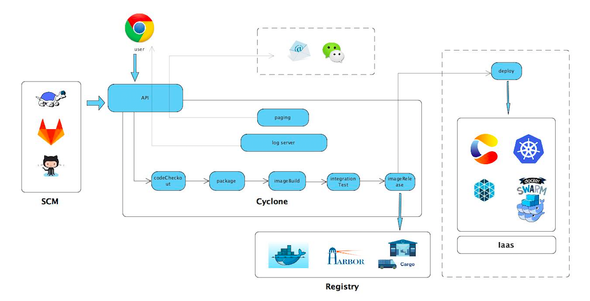
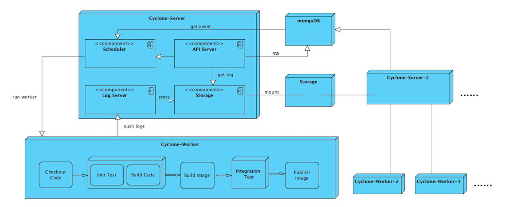

<!-- START doctoc generated TOC please keep comment here to allow auto update -->
<!-- DON'T EDIT THIS SECTION, INSTEAD RE-RUN doctoc TO UPDATE -->
**Table of Contents**  *generated with [DocToc](https://github.com/thlorenz/doctoc)*

- [Developer Guide](#developer-guide)
  - [The process of developing the Cyclone project](#the-process-of-developing-the-cyclone-project)
  - [Setting up your dev environment](#setting-up-your-dev-environment)
  - [Test your contribution](#test-your-contribution)
    - [Unit Testing](#unit-testing)
    - [End-to-end Testing](#end-to-end-testing)
  - [API Documentation](#api-documentation)
  - [Architecture and workflow of the Cyclone project](#architecture-and-workflow-of-the-cyclone-project)
    - [Workflow](#workflow)
    - [Architecture](#architecture)

<!-- END doctoc generated TOC please keep comment here to allow auto update -->

# Developer Guide

This section of the documentation contains a guide for users who want to contribute code or documentation to Cyclone.

## The process of developing the Cyclone project

Now the Cyclone project is hosted on Github, so we follow the [github flow](https://guides.github.com/introduction/flow/), you could learn it within 5 minutes:)

## Setting up your dev environment

We have written some bash scripts to help you start contributing code or documentation to the Cyclone project.

If you want to start a cyclone server for dev, you could run:

```shell
./scripts/setup.sh
```

The script would run all the dependencies in docker containers, compile and run cyclone server **locally**. This way is more hackable than running all services in containers.

Notice that if your docker daemon is running in a docker machine, maybe you need to do some additional work, such as port forwarding and so on.

## Test your contribution

We have unit test and e2e test cases, you could run these test cases to test your contribution.

### Unit Testing

You could run unit test by typing:

```shell
./scripts/unittest.sh
```

And Our travis CI jobs would also run these, so you could also check out the build log to get the test result in travis. In the future we would run these tests by cyclone.

### End-to-end Testing

Now cyclone's e2e test would start a local cyclone server and register local docker host as a worker to cyclone server. Then it would start a standalone process to run the e2e test cases by sending RESTful requests.

The e2e test can be run by cyclone itself.
If you deploy with docker, you could run it by typing:

```shell
./scripts/e2e-docker.sh
```

If you deploy with k8s, you could run e2e test by typing:

```shell
./scripts/e2e-k8s.sh
```

## API Documentation

We use [swagger ui](https://github.com/swagger-api/swagger-ui) to generate API documentation. If your work impacts cyclone API, you could check out API documentation at `http://<your cyclone server host>:7099/apidocs`, else you could check out [our online API documentation](http://117.149.19.162:30010/apidocs/).

## Architecture and workflow of the Cyclone project

### Workflow



Dotted box represents features are in plan.

Cyclone provides abundant [APIs](http://118.193.142.27:7099/apidocs/) for web applications.

- It is necessary to creat a pipeline based on a repo in your SCM by cyclone-server API firstly, and define your CI/CD actions in each pipeline stage.
- Trigger cyclone-server to execute pipeline manually or by defined webhook(tag, pull request, comments on PR, commit).
- Cyclone-Server will run a Cyclone-Worker container which uses the “Docker in Docker” technique. The Cyclone-Worker container will execute steps according to the configrations you defined as follows:
  - codeCheckout : checkout code from your specific repository.
  - package : compile the source by defined commands in the specified system environment.
  - imageBuild : build a docker image by a specified Dockerfile.
  - integrationTest : run a container and bring up its dependencies (as other containers specified in the configuration) to test the images built in `imageBuild` stage.
  - imageRelease : push the images to the specified docker registry.
  - deploy : deploy the containerized application into a containerized platform like Kubernetes(stay tuned).
- The logs durning the entire workflow can be pulled from Cyclone-Server via websocket.
- Cyclone-Server will send the results and the complete logs of CI & CD workflow to users by email when the progress has been finished(stay tuned).


### Architecture



Each cube represent a container

- The API-Server component in Cyclone-Server provides the restful API service. If the task created by calling the API needs long time to handle, Cyclone will generate a pending event and write it into mongoDB.
- The Scheduler component loads pending events from mongoDB, watches the changes of events, and run a Cyclone-Worker container to execute the event. The information send to worker by ENVs.
- Cyclone-Worker uses event ID as a token to call the API server and gets event information, and then runs containers to execute codeCheckout, package, imageBuild, integrationTest and imageRelease steps. Meanwhile, the workflow logs are pushed to the Log-Server and saved to file system.
- Log-Server component receives logs from cyclone-worker and stores them.
- The data which need to be persisted are saved into mongo.
