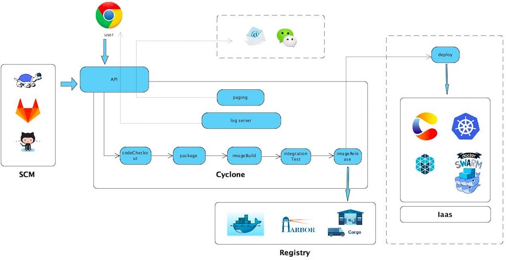
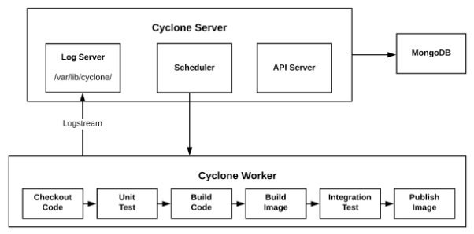

<!-- START doctoc generated TOC please keep comment here to allow auto update -->
<!-- DON'T EDIT THIS SECTION, INSTEAD RE-RUN doctoc TO UPDATE -->
**Table of Contents**  *generated with [DocToc](https://github.com/thlorenz/doctoc)*

- [开发者指南](#%E5%BC%80%E5%8F%91%E8%80%85%E6%8C%87%E5%8D%97)
  - [向 Cyclone 进行贡献的工作流](#%E5%90%91-cyclone-%E8%BF%9B%E8%A1%8C%E8%B4%A1%E7%8C%AE%E7%9A%84%E5%B7%A5%E4%BD%9C%E6%B5%81)
  - [搭建你的开发环境](#%E6%90%AD%E5%BB%BA%E4%BD%A0%E7%9A%84%E5%BC%80%E5%8F%91%E7%8E%AF%E5%A2%83)
  - [测试 Cyclone](#%E6%B5%8B%E8%AF%95-cyclone)
    - [单元测试](#%E5%8D%95%E5%85%83%E6%B5%8B%E8%AF%95)
    - [端到端测试](#%E7%AB%AF%E5%88%B0%E7%AB%AF%E6%B5%8B%E8%AF%95)
  - [API 文档](#api-%E6%96%87%E6%A1%A3)
  - [Cyclone 架构以及工作流](#cyclone-%E6%9E%B6%E6%9E%84%E4%BB%A5%E5%8F%8A%E5%B7%A5%E4%BD%9C%E6%B5%81)
    - [工作流](#%E5%B7%A5%E4%BD%9C%E6%B5%81)
    - [软件架构](#%E8%BD%AF%E4%BB%B6%E6%9E%B6%E6%9E%84)

<!-- END doctoc generated TOC please keep comment here to allow auto update -->

# 开发者指南

这份文档提供给想为 Cyclone 贡献代码或者文档的用户。

## 向 Cyclone 进行贡献的工作流

因为 Cyclone 是在 Github 上开源的，因此我们使用 [Github Flow](https://guides.github.com/introduction/flow/) 作为协作的工作流，你可以花五分钟的时间来了解下它 :)

## 搭建你的开发环境

我们已经写了一些 bash 脚本来帮助你搭建开发环境。如果你想在本地运行一个 Cyclone 服务，可以通过：

```shell
./scripts/setup.sh
```

来实现，这段脚本会在容器中启动所有的依赖服务，在**本地**编译和运行 Cyclone server，相比于把全部服务都运行在容器中的方式，在本地运行 Cyclone server 更容易开发与调试。

请注意，如果你的 docker daemon 是运行在一个 docker machine 中的，那么你可能需要做一些额外的工作，比如端口映射等等。

## 测试 Cyclone

我们有单元测试和端到端的测试用例，当你想为 Cyclone 贡献时可以使用它们来进行代码的测试。

### 单元测试

你可以通过：

```shell
./scripts/unittest.sh
```

来进行单元测试，与此同时目前我们的 Travis 也会进行这样的单元测试，因此你也可以在 Travis 的构建日志中查看测试结果。在之后我们会使用 Cyclone 来对 Cyclone 进行单元测试。

### 端到端测试

目前 Cyclone 的端到端测试会先启动一个 Cyclone server，然后在另外一个独立的进程中通过发送 RESTful 请求的方式对其进行测试，并验证结果。

我们可以使用 Cyclone 来对 Cyclone 进行端到端的测试。
如果你以docker方式部署，你可以通过：

```shell
./scripts/e2e-docker.sh
```

如果你以k8s方式部署，你可以通过：

```shell
./scripts/e2e-k8s.sh
```

## API 文档

我们使用 [swagger ui](https://github.com/swagger-api/swagger-ui) 来生成 API 文档，如果你的工作影响了 Cyclone 的 API，你可以在 `http://<your cyclone server host>:7099/apidocs` 查看最新的 API 文档，或者你可以通过我们的[在线文档](http://117.149.19.162:30010/apidocs/)来进行开发与贡献。

## Cyclone 架构以及工作流

### 工作流



 虚线框表示规划中的特性

 Cyclone提供了丰富的[API](http://118.193.142.27:7099/apidocs/)供web应用调用（详见API说明）

- 通过调用cyclone-serser的API创建一个基于软件配置管理（SCM）系统中某代码库的流水线
- 在流水线中定义要执行的各个阶段的操作
- 直接手动触发，或者通过SCM的提交、发布等动作以webhook的形式触发Cyclone-Server
- Cyclone-Server启动一个基于Docker in Docker技术的Cyclone-Worker容器，在该容器中，按照pipeline的配置，依次执行：
  - codeCheckout：从指定代码库中拉取源码
  - package：启动用户配置的镜像，执行用户配置命令构建代码
  - imageBuild：根据用户指定的Dockerfile制作镜像
  - integrationTest：运行持续集成所依赖的微服务，启动一个容器对imageBuild阶段构建成功的镜像执行集成测试
  - imageRelease：将构建成功的镜像发布到镜像仓库中
- 构建过程日志可以通过Websocket从Cyclone-Server拉取
- 构建结束后Cyclone-Server将构建结果和完整构建日志通过邮件通知用户

工作流示例可参考[快速开始](./quick-start_zh-CN.md)

### 软件架构



- Cyclone-Server中Api-Server组件提供Restful API服务，被调用后需要较长时间处理的任务生成一个待处理事件写入mongoDB
- Scheduler定期从mongoDB任务队列中获取任务，然后调度worker运行
- Cyclone-Worker启动后，从server获取任务信息，然后执行pipeline的各个stage，在执行的同时，将日志实时输出到server
- Log-Server负责收集Worker发送过来的实时日志，并持久化到本地的日志文件中
