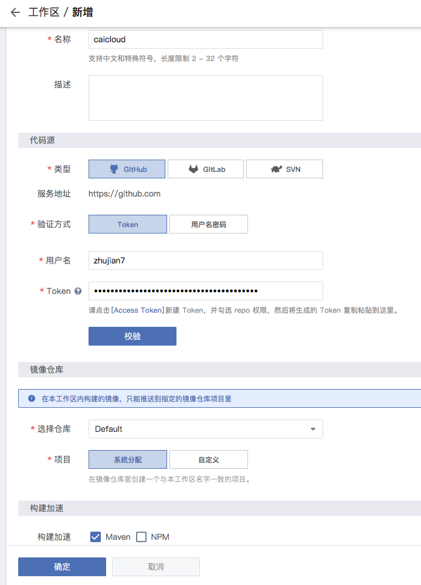
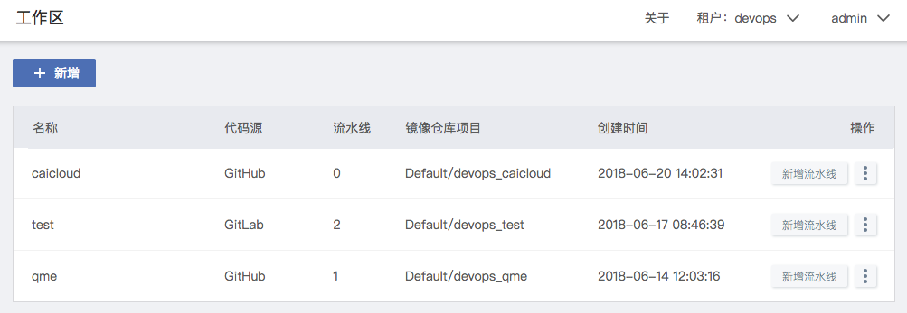
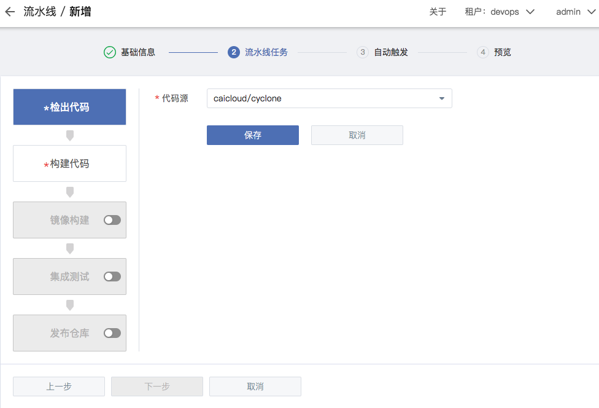
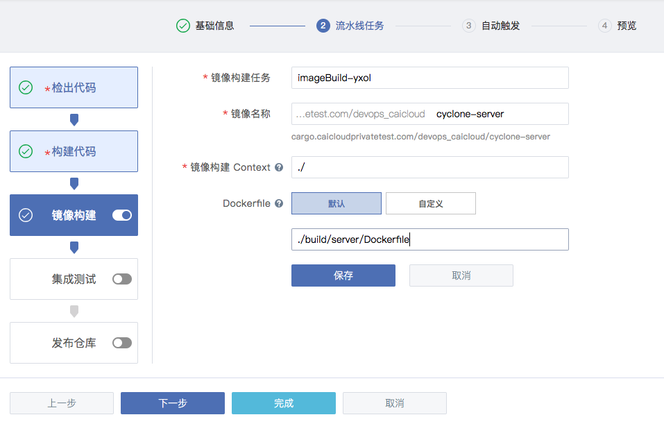
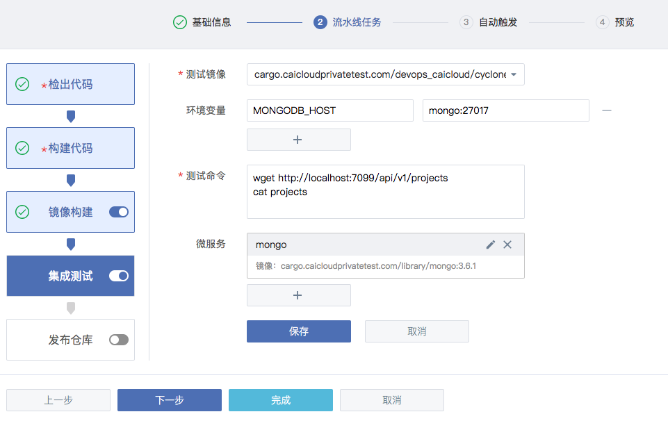
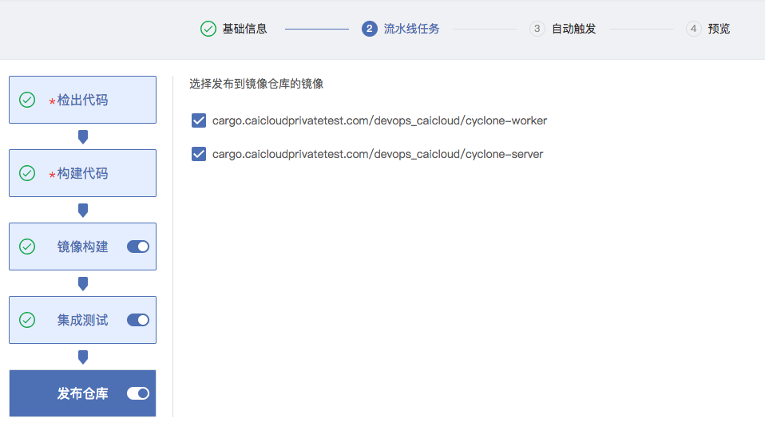
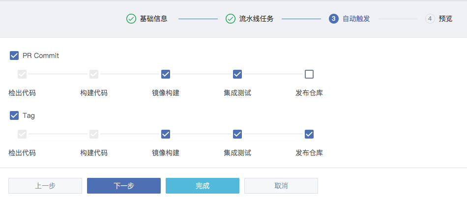
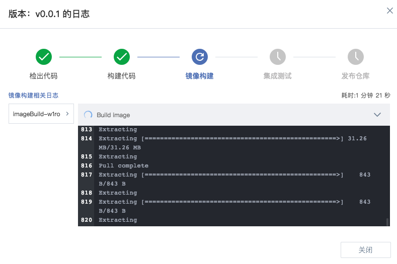

<!-- START doctoc generated TOC please keep comment here to allow auto update -->
<!-- DON'T EDIT THIS SECTION, INSTEAD RE-RUN doctoc TO UPDATE -->
**Table of Contents**  *generated with [DocToc](https://github.com/thlorenz/doctoc)*

- [Function Introduction](#function-introduction)
  - [Convenient management](#convenient-management)
  - [Continuous integration](#continuous-integration)
  - [Trigger automatically](#trigger-automatically)
  - [Real-time logs](#real-time-logs)

<!-- END doctoc generated TOC please keep comment here to allow auto update -->

# Function Introduction

## Convenient management
<!--## Relating with SCM systems -->

The convenient way to manage a group of pipelines is creating project related with a variety of SCM systems, such as GitHub, GitLab, SVN.

- Create project related with SCM 

	

- List all projects

	

## Continuous integration

All of the processes in workflow are visible. "codeCheckout" checkout code from specific repository; "package" compile the source code; "imageBuild" builds the published image; "integration" executes the integrated test; "imageRelease" publishes the image. All of the processes are shipped by container. It will wipe off the differences caused by environment.

- codeCheckout

	

- package

	

- imageBuild

	

- integration

	

- imageRelease

	

## Trigger automatically

Cyclone has been integrated with a variety of VCS tools, such as git, svn, etc. After OAuth, it can pull codes from repository and create webhook. Whenever the user commits, submits a pull request or releases a version to the repository, the webhook will trigger the CI/CD workflow. 

Cyclone supports configuring GitHub/GitLab webhook while creating pipeline. Whenever the user commits, submits a pull request or releases a version to the repository, the webhook will trigger the CI/CD workflow. 

- Configure webhook

	

## Real-time logs

Cyclone provides real-time logs of every pipeline stage while the pipeline is running. 

- Running log

	

