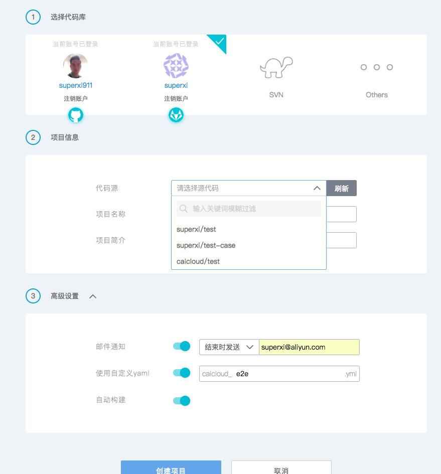
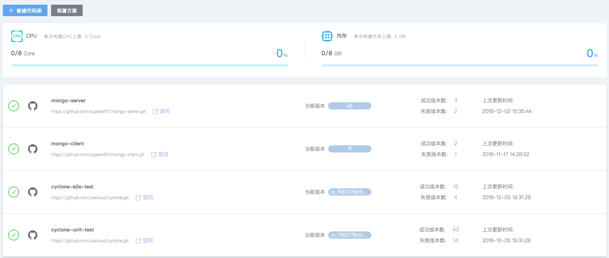
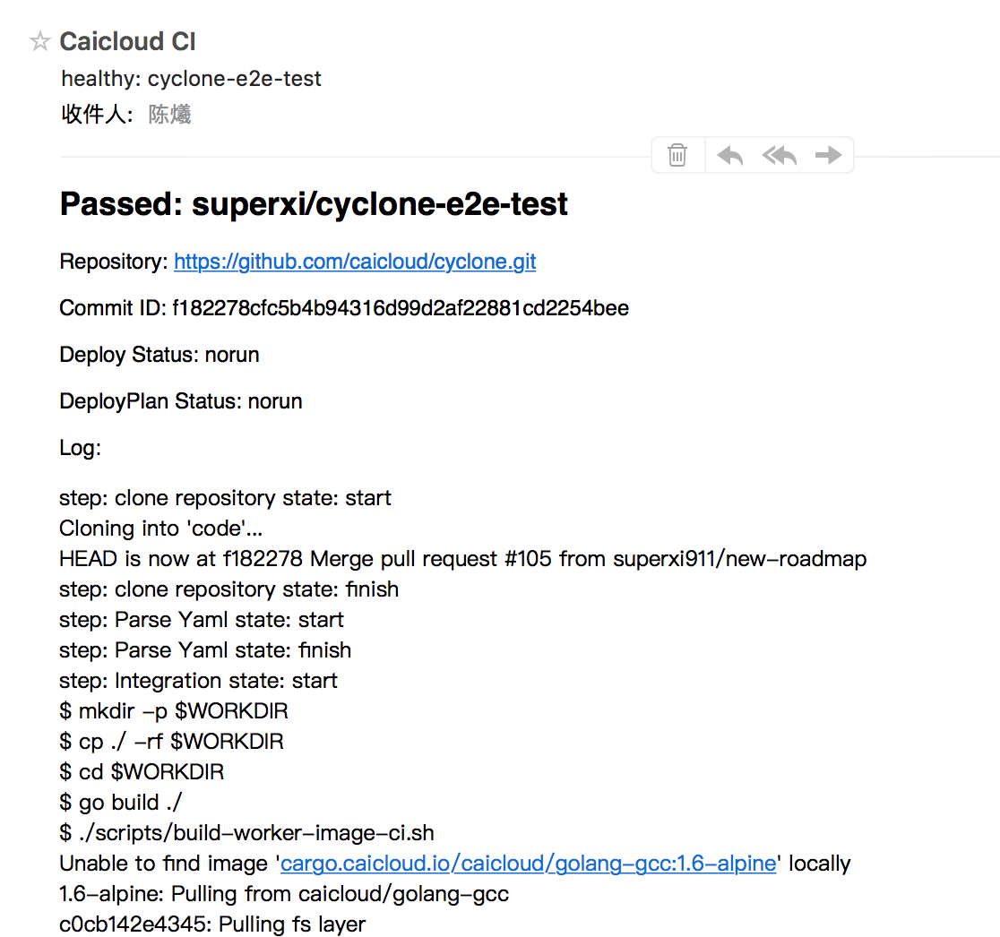
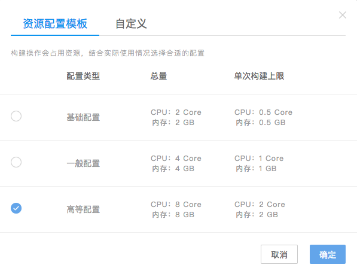
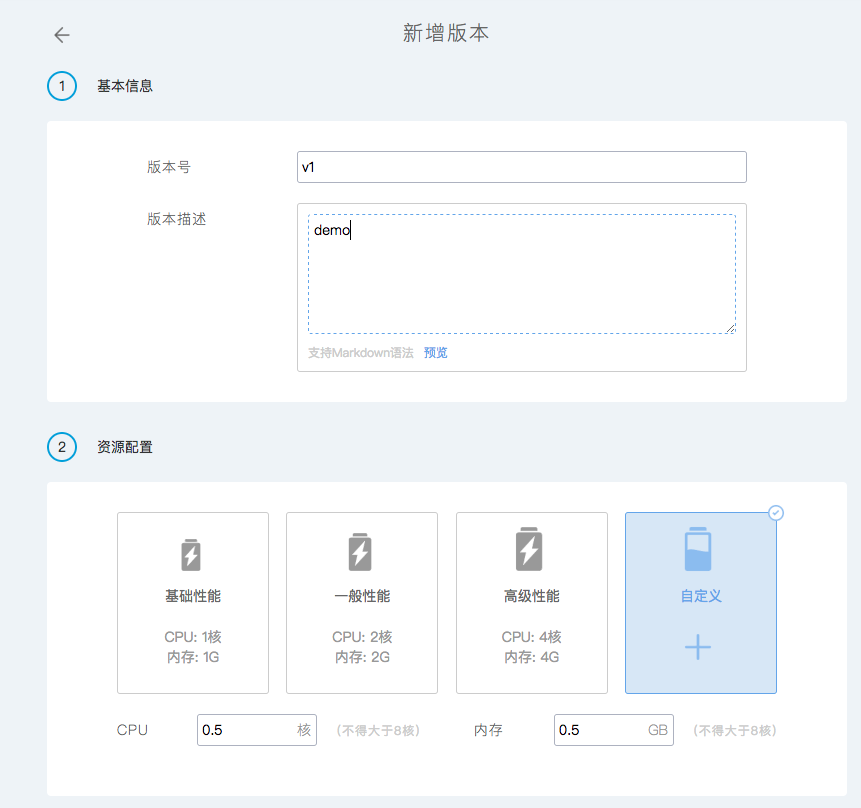
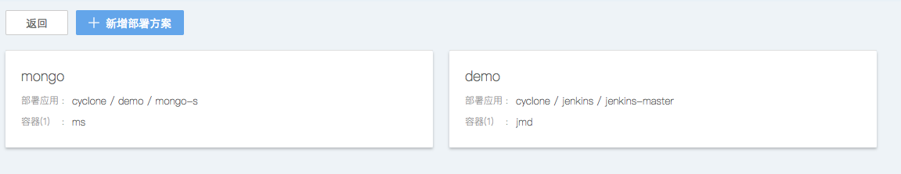

# Function Introduction

## Relating with VCS tools

Cyclone has been integrated with a variety of VCS tools, such as git, svn, etc. After OAuth, it can pull codes from repository and create webhook. Whenever the user commits, submits a pull request or releases a version to the repository, the webhook will trigger the CI/CD workflow. 

- Creating a service relating with the VCS tools

	

- Listing all services

	

## Continus integration and security scanning

All of the processes in workflow are visible. "prebuild" compiles the executable files. "build" builds the published image. "integration" executes the integrated test. "publish" publishes the image and scans the vulnerabilities. "post build" does some relating operations after image published. "deploy" uses the published image to deploy a application to Kubernetes or any other container cloud platform. Cyclone would send email to notify the result of the workflow. All of the processes are shipped by container. It will wipe off the differences caused by environment. 

- Log of the workflow

	

- Security scanning

	

- Sending the build log via email 

	

## Resource management

Cyclone separates the logic of scheduling and the building workflow. It also supports to add user worker nodes and various quota plans. 

- Setting of user resource configuration

	

- Resource quota of single building

	

## Union publishing and dependency management

Cyclone can manage multi-component united builds. It uses the graphical user interface to display and manage the dependency of the components. 

	

## Continus delivery

Cyclone provides flexible and continuous deployment based on release policy and role control, provides upgrade and rollback policies based on container and image version control.

- various deploying plans

	

