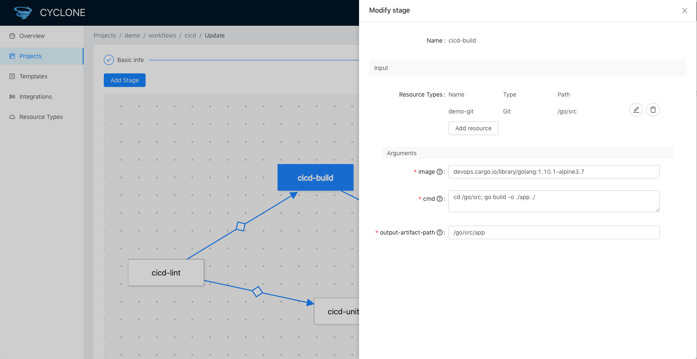

<!-- START doctoc generated TOC please keep comment here to allow auto update -->
<!-- DON'T EDIT THIS SECTION, INSTEAD RE-RUN doctoc TO UPDATE -->
**Table of Contents**  *generated with [DocToc](https://github.com/thlorenz/doctoc)*

- [Cyclone Web User Guide](#cyclone-web-user-guide)
  - [Introduction](#introduction)
    - [Overview](#overview)
    - [Projects](#projects)
      - [Resources](#resources)
      - [Workflows](#workflows)
    - [Templates](#templates)
    - [Integrations](#integrations)
    - [Resource Types](#resource-types)
  - [Quick Start](#quick-start)

<!-- END doctoc generated TOC please keep comment here to allow auto update -->

# Cyclone Web User Guide  
  
`Cyclone Web` provides a user friendly interface for users to interact with Cyclone. This document guides users how to use Cyclone web to build and execute workflows.

## Introduction

Cyclone Web consists of five components:

- Overview: Overview of the Cyclone platform.
- Projects: Workflows are managed in projects, it's the main component of Cyclone web.
- Templates: Stages templates for Cyclone.
- Integrations: Integrated external services like Github, Docker registry.
- Resource Types: Manage resource types Cyclone supports.

### Overview

### Projects

Workflows in Cyclone are managed by projects. Project is a logical group of workflows. Users can define some common properties in project to be used by workflows belonging to it.

3 kinds of resources are managed in project:

- **Stages**  Execution unit of workflow. It defines how a stage works.
- **Resources** Resource instances to be used in workflows
- **Workflows** Workflows

#### Resources

Resources are first-class resources in Cyclone, before create workflow, users need to create resources first. Resources describes input/output data for workflow stages. When users create workflows, they can use resources defined here.

#### Workflows

Workflow information and execution records are managed here.  Users can also execute the workflow, or edit the workflow.

By clicking the workflow stage in the DAG graph, users can open slide window to edit a selected stage, and click outside the slide window to save the change.

If users want to add one dependency in the graph, hold the `SHIFT` key and drag to add the arrow. `DELETE` key can help to delete a arrow or stage.

### Templates

Stage templates helps Cyclone to fit in different kinds of scenes. A stage template describes how a stage works, and expose arguments to use it. Cyclone provides built-in templates for CI/CD scene:

- Build
- Unit Test
- Code Scan
- Image Build
- CD

A stage template defines input, output of a stage and expose necessary arguments for users to use the template.

### Integrations

Integration in Cyclone holds information of an external service/system, such as Docker Registry, SonarQube server. Access URL, credentials are managed here, Cyclone will refer to them when needed. For example, resource would have parameter values injected automatically when bind to an integration.

Users can edit existed integrations, or create new integrations here. For the moment, only some fixed type integrations (`SCM`, `DockerRegistry`, `SonarQube`, `Cluster`)  are supported in Cyclone web, an extensible way for general type integrations will come soon, please stay tuned.

### Resource Types

Resource describes external data to be used as input/output to Cyclone workflows.

Different resource types describe different kinds of resource.  For the moment, Cyclone supports 3 built-in resource types: `Git`, `Svn`, `Image`.

Each resource type contains following information:

- **Resource type name**: For example `Git`
- **Supported operations**: For resource, valid operations are: `pull`, `push`, resource types with `pull` supports can be used as input to Cyclone workflows, while resources types with `push` supports can be used as outputs. For example, `Git` supports `pull`, so it can be used as input to Cyclone workflows.
- **Resolver**:  Image corresponds to the resource type that helps to resolve the resource, by resolve, it means pull the resource or push the resource based on parameters given.
- **Parameters**: A set of parameters to describe the resource type, for example, to describe a `Git` resource, we need `SCM_URL`, `SCM_REPO`, `SCM_REVISION` and optional `SCM_AUTH`. Each parameter can have a detailed description attached, which will be shown as hint when users are required to input parameter values.
- **Integration Binding**: Integration binding describes how the resource type binds to an external service. Give `Image` as an example, it needs to interact with external Docker registry, so `Image` resource type can be bound to integration type `DockerRegistry` (which contains information like url, credential of a docker registry). By the binding, information like URL, credentials (user/password, token) can be injected to resource automatically, relieve users from specifying these information when create resources. Binding includes two steps: specify an integration type, map resource parameters to integration fields.

Users can also define their own resource types here.

## Quick Start

This section shows steps to build a CI/CD workflow from scratch.

- Create integrations for SCM (GitHub, Gitlab) and Docker registry (if want to push images)
- Create a project
- In the project, create resources to be used for CI/CD workflows, for example, `Git` resource to describe source code, `Image` resource to describe images to push
- Create workflow. Each stage can be created from stage templates. And resources defined previously can be used as stage input/output.
- Execute the workflow created

