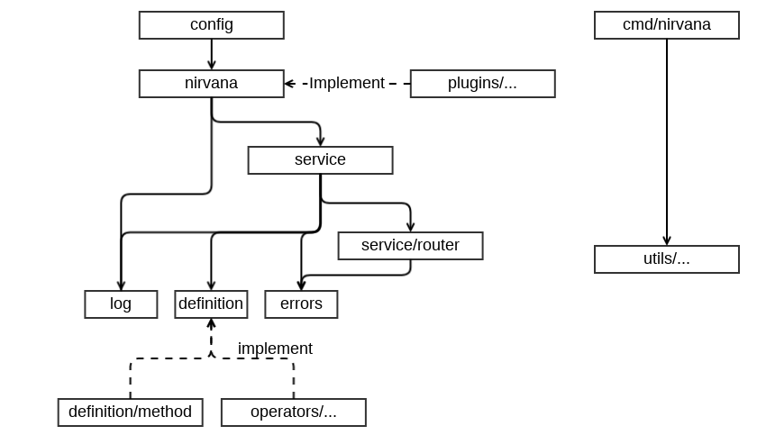

# 准备工作

## 开发工具介绍
1. golang：https://golang.org/dl/
1. dep：https://github.com/golang/dep
1. gometalinter：https://github.com/alecthomas/gometalinter

一般情况下，我们使用最新版本的 golang 进行开发，但是需要保证两个 golang 大版本的兼容性。即使用 1.10.x 开发的情况下，需要保持对 1.9.x 的兼容性。
另外 Nirvana 只使用 dep 进行依赖管理，不要使用其他依赖管理工具对 vendor 进行任何更新操作。并且所有的依赖需要放置在根目录的 vendor 中，不能在任何子目录下使用 vendor。
除了常规的 go test 测试以外，还需要使用 gometalinter 进行代码检查，gometalinter 的配置文件在根目录的 config.json 中。

## 工作流程

在 githuh 上 Fork [Nirvana](https://github.com/caicloud/nirvana/) 到自己的账户下，然后下载源码到本地开发目录中：
```
$ cd $GOPATH/src
$ mkdir -p github.com/caicloud/
$ cd github.com/caicloud/
$ git clone git@github.com:{your account}/nirvana.git
```
在完成修改并提交到自己的 repo 之后，通过 github PR 的形式向 Nirvana 提交代码。

## 框架设计概览

Nirvana 框架的设计核心思想是：**隔离 API 定义和业务逻辑实现**

也就是在使用框架的过程中，用户的业务函数的表现形式与其他普通函数没有差别。基于此，框架中的每个组件和工具包都不应该侵入用户的业务逻辑。如果存在必须要业务逻辑作出处理的功能，也应当以接口的形式提供，并且允许用户自行扩展。

Nirvana 包之间的依赖关系：


1. 其中 log 与 errors 是基础包，分别负责日志基础接口和错误处理基础接口。
1. definition 包包含 Nirvana 框架的 API 定义以及一些相关的工具方法。作为框架的基础，这个包不能依赖其他任何包。
1. definition/method 帮助用户把实例方法转换为 definition 函数。请参考 [方法包](../concepts/method.md)。
1. operators 中包含了两个组件功能实现了 converters 和 validators，用于 API 参数的类型转换和数据验证。
1. service/router 包实现了基于前缀树的路由和中间件功能。
1. service 包实现了框架 API 路由和处理的所有功能。
1. nirvana 包实现了 API Server 以及插件化功能。
1. plugins 中包含了许多实现了 nirvana 插件接口的插件。
1. config 包实现了 Nirvana Command 功能，并提供了从 flags，环境变量，配置文件中读取配置的能力。这个包也是用户使用 Nirvana 的入口包。
1. utils 包包含多个工具用于 API 生成，客户端代码生成，项目结构生成。
1. cmd/nirvana 是 Nirvana 的主要命令，利用 utils 包帮助用户快速构建项目。

在后续的文档中，会逐步介绍每个包的设计方法和主要代码逻辑。
